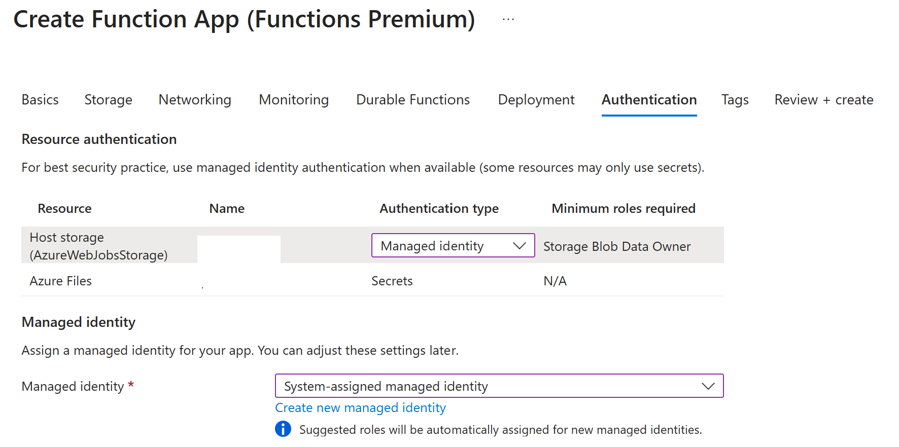

# Agent AI Foundry – Azure Function Wrapper

Azure Function wrapper serving Agent AI Foundry agents.

## 🔧 Prerequisites

You need to create your agent using the Agent AI Foundry Agent Service. To create an agent via SDK or integrate it with a tool, check the tool use patterns in [agent-ai-foundry-tool-use](https://github.com/kimtth/agent-ai-foundry-tool-use)

## 🔧 Background

The link only supports single-turn conversations and does not handle threaded interactions. The functions provide two endpoints: one for `creating a chat` and another for `continuing a conversation with an agent using a thread ID`.

> 💡 [Integrate Custom Azure AI Agents with CoPilot Studio and M365 CoPilot](https://techcommunity.microsoft.com/blog/aiplatformblog/integrate-custom-azure-ai-agents-with-copilot-studio-and-m365-copilot/4405070)

## 📦 Deployment

Use the Azure Functions Core Tools to publish your Python function app:

```bash
func azure functionapp publish <your-func-app-name> --python
```

---

## 💡Azure Function App: Tips for configuration 

Tips for environments that don’t allow using access keys to authenticate to the storage account (AzureWebJobsStorage)

### 1. Deployment Commands

#### Publish to Azure Function App

```bash
func azure functionapp publish <your-func-app-name> --python
```

#### Package as a Zip File

```bash
func pack --output functionapp.zip
```

> **Note:** The Flex Consumption plan doesn't support zip deployment. See the [Azure Functions storage considerations](https://learn.microsoft.com/en-us/azure/azure-functions/storage-considerations?tabs=azure-cli#create-an-app-without-azure-files) for more details on creating an app without Azure Files.

### 2. Environment Variables for Managed Identity

To use Managed Identity for accessing the storage account without an access key, follow these steps:

### Option 1. Configure Managed Identity in Azure Portal

1. Navigate to the **Authentication** tab during **Create Function App** in the Azure Portal.
2. Select **Managed Identity** and **System-assigned managed identity**.
    

### Option 2. Manually Set Environment Variables

Set the following environment variables for your Azure Function App:

- `AzureWebJobsStorage__blobServiceUri`: `https://<your-storage-account-name>.blob.core.windows.net`
- `AzureWebJobsStorage__credential`: `managedidentity`
- `AzureWebJobsStorage__queueServiceUri`: `https://<your-storage-account-name>.queue.core.windows.net`
- `AzureWebJobsStorage__tableServiceUri`: `https://<your-storage-account-name>.table.core.windows.net`
